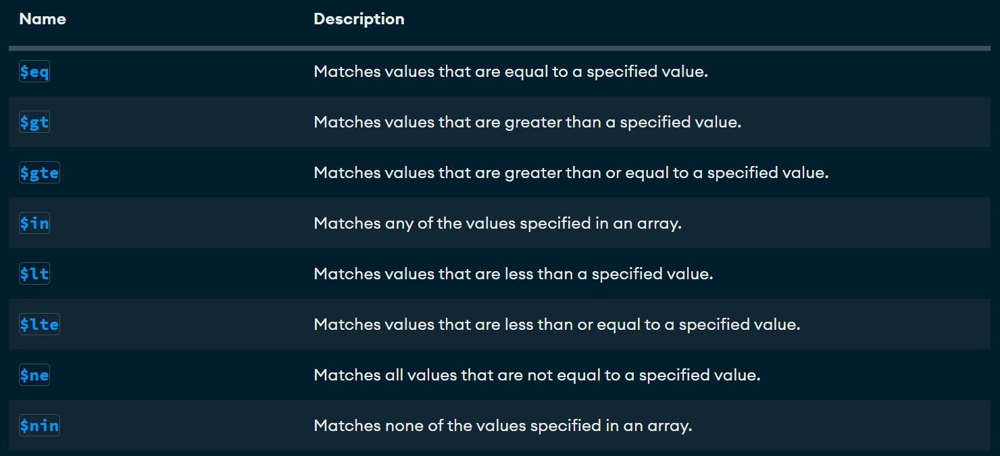

# MongoDB Crud

## Crear una base de datos 

**Solo se crea si contiene por lo menos una coleccion**

```json
use basededatos
```
## Crear una coleccion
`use bd1
db.createCollection('Empleado')`

## Mostrar collecciones 
`show collections`

## Insercion de un documento 
db.Empleado.insertOne(
  {
      nombre:'Soyla',
      apellido: 'Vaca',
      edad: 32,
      cuidad: 'San Miguel de las Piedras'
  }
)

## Insercion de un documento mas complejo con array 

```json 
db.Empleado.insertOne({
   nombre: 'Ivan',
   apellido:'Baltazar',
   apellodo2: 'Rodriguez',
   aficiones:['Cerveza', 'Canabis', 'Crico','Mentir']
})
```

## Eliminar una coleccion **
```json
db.coleccion.drop()
```
__Ejemplo__
```json 
db.empleado.drop()
```

## Entrar a la base de datos 
use db1

## insercion de documentos mas complejos con anidados, arrays y ID 
```json
db.alumnos.insertOne(
{
  nombre:'Jose Luis',
  apellido1:'Herrera',
  apellido2: 'Gallardo',
  edad: '41',
  estudios:[
    'Ingenieria en sistemas computacionales',
    'Maestria en administracion de tencologias de informacion'
  ],
 experiencias: {
         lenguaje:'SQL', 
         sgb : 'sqlServer',
         anios_Experiencias: 20
  }
}
)
```
```json
db.alumnos.insertOne({
   _id:3,
   nombre:'Sergio',
   apellido:'Ramos',
   equipo:'Monterrey',
   aficiones:['Dinero','Hombres','Fiesta'],
   talentos:{
    futbol:true,
    banarse: false
   }
})
```
## insertar multiples documentos 
```json
db.alumnos.insertMany(
[
  {
    _id:12,
    nombre: 'Oswaldo',
    apellido:'Venado',
    edad:20,
    descripcion:'es un quejumbroso'
  },
  {
    nombre:'Maritza',
    apellido:'Rechicken',
    edad:20,
    habilidades:['ser vibora', 'ilusionar','caguamear'] ,
    direccion:{
      calle:'del infierno',
      numero:666
   },
   esposos:[
    {
      nombre:'Joshua',
      edad:20,
      pension:-34,
      hijo:['ivan','jose']
    },
    {
      nombre:'leo',
      edad:15,
      pension:70,
      complaciente:true
    }
   ] 
  }
  ]
)
```
# Busquedas. Condiciones simples de igualdad. Metodo find 
1. Seleccionar todos los documentos de la coleccion libros 
```json
db.libros.find({})
```
2. Seleccionar todos los documentos que sean de la editorial Biblio 
```json
db.libros.find({editorial:'Biblio'})
```
3. Mostrar todos los documentos que el precio sea 25
```json
db.libros.find({precio:25})
```
4. Seleccionar todos los documentos donde el titulo sea 'JSON para todos'
```json
db.libros.find({titulo:'JSON para todos'})
```

## Operadores de comparacion
[Operadores de comparacion](https://www.mongodb.com/docs/manual/reference/operator/query/)



1. Mostrar todos los documentos donde el precio sea mayor a 25
```json
db.libros.find({precio:{$gt:25}})
```

2. Mostrar los documentos donde el precio sea 25 
```json
db.libros.find({precio:25})
db.libros.find({precio:{$eq:25}})
```
3. Mostrar los documentos cuya cantidad sea menor a 5 
```json
db.libros.find({cantidad:{$lt:5}})
```
4. Mostrar los documentos que pertenecen a la editorial biblio o planeta 
```json
db.libros.find({editorial:{$in:['Biblio', 'Planeta']}})
```
5. Mostrar todos los documentos de libros que cuesten 20 o 25
```json
db.libros.find({precio:{$in:[20,25]}})
```
6. Recuperar todos  los docuementos que no cuesten 20 o 25 
```json
db.libros.find({precio:{$nin:[20,25]}})
```

## Instruccion findOne
7. Recuperar solo una fila que devuelve el primer elemento que cumpla la condicion 
```json
db.libros.findOne({precio:{$in:[20,25]}})
```
## Operadores logicos 
[Operadores logicos](https://www.mongodb.com/docs/manual/reference/operator/query-logical/)

### Operador AND 
- Dos posibles opciones 
  1. La simple forma, mediante condiciones separadas por comas 
    - db.libros.find({condicion1, condicion2,....}) -> Con esto asume que es una AND 
  1. Usando el operador $and 
     { $and: [ { <expression1> }, { <expression2> } , ... , { <expressionN> } ] }
    - db.libros.find({ $and: [{condicion1}, {condicion2}]})

1. Mostrar todos aquellos libros que cuesten mas de 25 y cuya cantidad sea inferior a 15 
```json
db.libros.find(
  {
    precio:{$gt:25},
    cantidad:{$lt:15}
  }
)
```
```json
db.libros.find (
   {
     $and:[
      {precio:{$gt:25}},
      {cantidad:{$lt:15}}
     ]
   }
)
```

### Operador or ($or)

- Mostrar todos aquellos libros que cuesten mas de 25 o cuya cantidad sea inferior a 15 
```json 
db.libros.find(
 {
   $or:[
    {
       precio: {$gt:25}
    },
    {
      cantidad:{$lt:15}
    }
      
  ]
 }
)
```

### Ejemplo con AND y OR Combinados 
- Mostrar los libros de la editorial Biblio con precio mayor a 40 o libros de la editorial Planeta con precio mayor a 30 
```json
db.libros.find(
  {
    $and: [
      {$or :[{ editorial: 'Biblio'}, {precio: {$gt:40}}]},
      {$or: [{editorial: {$eq:'Planeta'}},{precio:{$gt:30}}]}
    ]
  }
)
```

```json
db.libros.find(
  {
    $and: [
      {$or :[{ editorial: 'Biblio'}, {precio: {$gt:30}}]},
      {$or: [{editorial: {$eq:'Planeta'}},{precio:{$gt:20}}]}
    ]
  }
)
```
### Proyeccion (ver ciertas columnas)
**Sintaxis**
db.coleccion.find(filtro, columnas)

1. Seleccionar todos los libros, solo mostrando el titulo 
```json
db.libros.find({},{titulo:1})

db.libros.find({},{titulo:1,_id:0})


db.getCollection('libros').find(
  { editorial: 'Planeta' },
  { _id: 0, titulo: 1, editorial: 1, precio: 1 }
);

```

### Operador exist (permite saber si un campo se encuentra o no en un documento)
[Operador exists](https://www.mongodb.com/docs/manual/reference/operator/query/exists/)

```json
{ field: { $exists: <boolean> } }
```
```json
db.libros.find({editorial:{$exists:true}})
```
- Buscar todos los documentos que no tengan cantidad 
```json
db.libros.find({cantidad:{$exists:false}})
```
```json
db.libros.insertOne(
    {
        _id:10,
        titulo: 'Mongo en Negocios Digitales',
        editorial:'Terra',
        precio: 125
    }
)
```

## Operador Type (permite solicitar a MongoDB si un campo corresponde a un tipo)
[Operador Typer](https://www.mongodb.com/docs/manual/reference/operator/query/type/)

- Mostrar todos los documentos donde el precio sea de tipo doble o entero o cualquier otro tipo de dato 
```json
db.libros.find(
  {
    precio:{$type:1}
  }
  
  )
```
```json
db.libros.find(
  {
    precio:{$type:16}
  }
  
  )
```
```json
db.libros.find(
  {
    precio:{$type:"int"}
  }
  
  )
```
```json
db.libros.insertMany([
   {
      _id:12,
      titulo: 'IA',
      editorial:'Terra',
      precio:125,
      cantidad:20
   },
   {
    _id:13,
    titulo: 'Python para todos',
    editorial: 2001,
    precio: 200,
    cantidad:30
   }


]) 

```
- Seleccionar todos los documentos de libros donde los valores de la editorial sean string 

```json
db.libros.find({editorial:{$type:2}})

db.libros.find({editorial:{$type:'string'}})

db.libros.find({editorial:{$type:"int"}})

db.libros.find({editorial:{$type:16}})

```

# Modificando documentos 
## Comandos importantes 
1. updateOne -> modifica un solo documentos 
1. updateMany -> modificar multiples documentos 
1. replaceOne -> sustituir el contenido completo de un documento 

Tiene el siguiente formato 
```json
db.collection.updateOne(
   {filtro},
   {operador:}
  )
```

[Operadores update](https://www.mongodb.com/docs/manual/reference/operator/update/)

**Operador $set**
1. Modifica un documento 
```json
db.libros.updateOne({titulo:'Python para todos'},{$set:{titulo:'Java para todos'}})

```

2. Modicar el documentos con id 10, estableciendo el precio en 100 y la cantidad en 50 
```json
db.libros.updateOne({_id:10},{$set:{cantidad:50, precio:100}})

```
3. Utilizando el updaMany, modificar todos los libros donde el precio sea mayor a 100 cambiarlo a 150
```json
db.libros.updateMany(
{
   precio:{$gt:100}
},
{
  $set:{precio:150}
}
)
```
db.libros.find({precio:{$gt:100}})

## Operadores $inc y $mul
-- Incrementar todos los precios de los libros en 5 
```json
db.libros.updateMany({editorial:'Terra'}, {$inc:{precio:5}})
```
-- Multiplicar todos los libros donde la cantidad sea mayor a 20, multiplicar la cantidad por 2($mul) 
```json

db.libros.updateMany(
{
   cantidad:{$gt:20}
},
{
  $mul:{precio:2}
}
)
```
-- Actualizar todos los libros multiplicando por 2 la cantidad y el precio de todos aquellos libros donde el precio sea mayor a 20 
```json

db.libros.updateMany(
{
   precio:{$gt:20}
},
{
  $mul:{cantidad:2, precio:2}
}
)
```
## Remplazar documentos (replaceOne)
-- Actualizar todo el documento del id 2 por el titulo De la tierra a la luna, autor julio verme, editorial Terra, precio 100
```json
db.libros.find({_id:2})

db.libros.replaceOne( 
    {_id:2},
    {
      titulo: 'De la tierra a la luna',
      autor: 'Julio verme',
      editorial: 'Terra',
      precio: 100
    }
  )                  
```
db.libros.replaceOne(
 {_id:2},
 {
  titulo:'La vid inutil de pito perez'
 } 
)

## Borrar documentos 
  1. deleteOne -> Elimina un solo documento 
  2. deleteMany -> Elimina multiples documentos 

  -- Eliminar el documento con el id 2 
  ```json
   db.libros.deleteOne(
     {_id:2}
     )
  ```
  -- Eliminar todos los libros donde la cantidad es mayor a 150
 ```json
   db.libros.deleteMany(
     {
      cantidad:{$gt:150}
     }
     )
  ```

  ## Expresiones regulares

   -- Seleccionar todos los libros que contengan  en el titulo una t minuscula
   ```json
   db.libros.find({titulo:/t/}) 
   ```
   -- Seleccionar todos los libros que en el titulo contenga la palabra JSON
   ```json
      db.libros.find({titulo:/JSON/}) 
   ```
   -- Seleccionar todos los libros que en el titulo terminen con tos 
   ```json
      db.libros.find({titulo:/tos$/}) 
   ```
   -- Seleccionar todos los libros que en el titulo terminen con j
   ```json
      db.libros.find({titulo:/^j/}) 
   ```
  ## Operador $regex
  [Operador Regex](https://www.mongodb.com/docs/manual/reference/operator/query/regex/)

  -- seleccionar los libros que contengan la palabra "para" en el titulo 
  ```json
  db.libros.find(

    {
      titulo:{
        $regex:/para/
      }
    }
  )
  ```
-- seleccionar todos los titulos que tengan la palabra JSON
```json
 db.libros.find(

    {
      titulo:{
        $regex:/JSON/
      }
    }
  )
  ```
  -- distinguir entre mayusculas y minisculas
  ```json
   db.libros.find(

    {
      titulo:{
        $regex:/json/i
      }
    }
  )

  {<field>: {$regex:/pattern/, $options:'<options>'}}

   db.libros.find(

    {
      titulo:{
        $regex:/json/, $options:'i'
      }
    }
  )
-- seleccionar todos los documentos de libros donde el titulo comience con j y no distinga entre mayuscula y minuscula 
  db.libros.find(

    {
      titulo:{
        $regex:/^j/, $options:'i'
      }
    }
  )
-- seleccionar todos los documentos de libros donde el titulo termine con es y no distinga entre mayuscula y minuscula (para que inicies es con ^ y para que termine $)
  db.libros.find(

    {
      titulo:{
        $regex:/es$/, $options:'i'
      }
    }
  )

  ```
  ## Metodo sort(Ordenar documentos)
-- ordenar los libros de manera ascendente por el precio
```json 
db.libros.find(
{},{
  _id:0,
  titulo:1,
  precio:1
}).sort({precio:1})


 ---ordenar los libros de manera descente por el precio
 db.libros.find(
{},{
  _id:0,
  titulo:1,
  precio:1
}).sort({precio:-1})

-- ordenar los libros de manera ascendente por la editorial y de manera descendente por el precio, mostrando el titulo, el precio y la editorial
 db.libros.find(
{},{
  _id:0,
  precio:1,
  editorial:1
}
).sort({precio:-1, editorial:1})

```
## otros metodos skip, limit, size
```json
db.libros.find(
  {}
 ).size()

  db.libros.find(

    {
      titulo:{
        $regex:/es$/, $options:'i'
      }
    }
  ).size()

  db.libros.find({}).limit(2)

  db.libros.find({}).skip(2)


```
  ## Borrar colecciones y base de datos
```json
  db.libros.drop()
  db.dropDatabase()

```